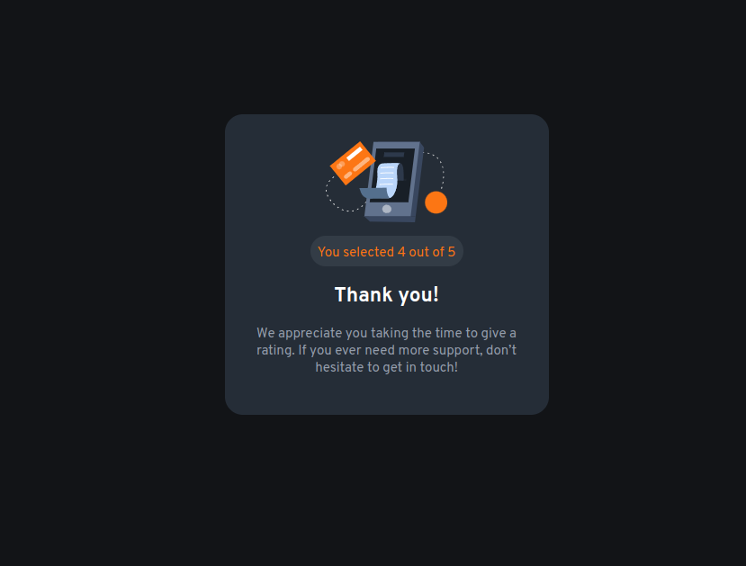

# Frontend Mentor - Interactive rating component solution

This is a solution to the [Interactive rating component challenge on Frontend Mentor](https://www.frontendmentor.io/challenges/interactive-rating-component-koxpeBUmI). Frontend Mentor challenges help you improve your coding skills by building realistic projects.

## Table of contents

- [Overview](#overview)
  - [The challenge](#the-challenge)
  - [Screenshot](#screenshot)
  - [Links](#links)
- [My process](#my-process)
  - [Built with](#built-with)
  - [What I learned](#what-i-learned)
  - [Continued development](#continued-development)
- [Author](#author)
- [Acknowledgments](#acknowledgments)

## Overview

### The challenge

Users should be able to:

- View the optimal layout for the app depending on their device's screen size
- See hover states for all interactive elements on the page
- Select and submit a number rating
- See the "Thank you" card state after submitting a rating

### Screenshot

### Links

* Solution URL: [Github](https://github.com/MonarchRyuzaki/Interactive-Rating-Component)
* Live Site URL: [Live Here !!](https://monarchryuzaki.github.io/Interactive-Rating-Component//)

## My process

### Built with

- Semantic HTML5 markup
- CSS custom properties
- Flexbox
- Mobile-first workflow

### What I learned

I understood the workflow of radio button event and events in general, like when the form is submitted the value is taken from given radio button and is used in the display section. This was fun.

### Continued development

Get More Experience with DOM manipulation and in using JS

## Author

* LinkedIn - [Shivam Ganguly](https://www.linkedin.com/in/shivam-ganguly-357b90255/)
* Frontend Mentor - [@MonarchRyuzaki](https://www.frontendmentor.io/profile/MonarchRyuzaki)

## Acknowledgments

Special Thanks to [Colt Steele](https://www.udemy.com/user/coltsteele/) for his [Web Development Bootcamp](https://www.udemy.com/course/the-web-developer-bootcamp/).
